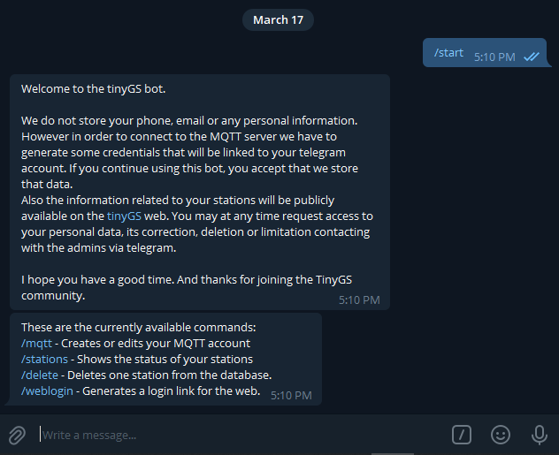
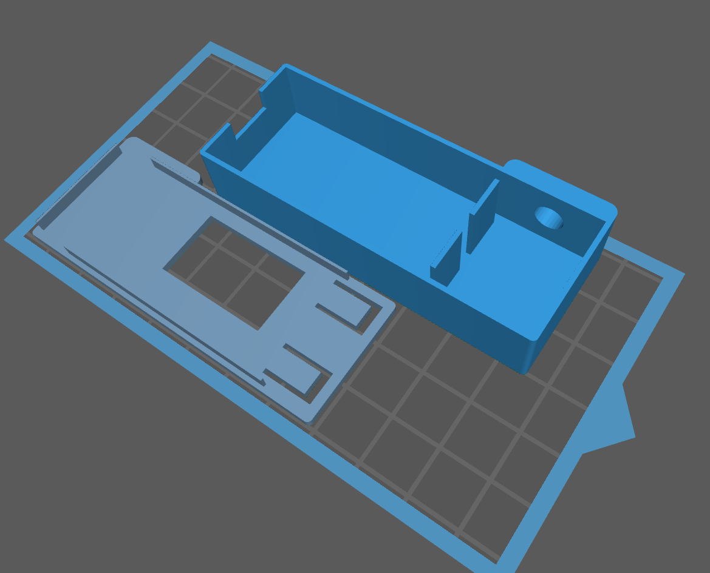
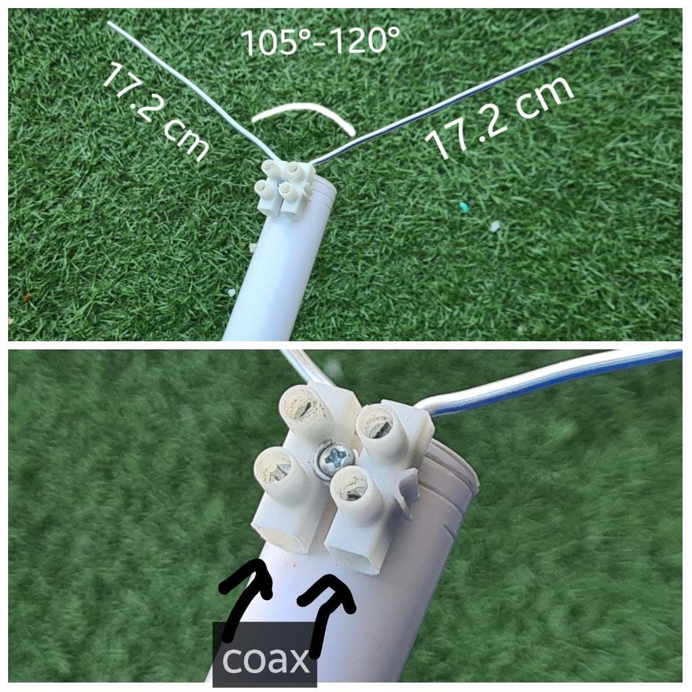
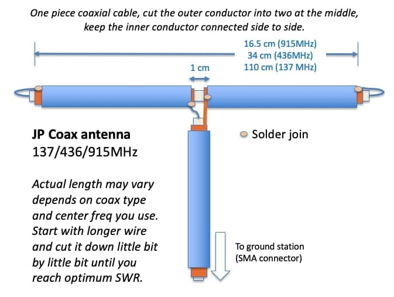

# Taller estación recepción de satélites LoRa TinyGS
Este repositorio contiene el código, información y documentación necesaria para montar un mini-recepor de señal de satélite con modulación LoRa.

El tipo de receptor se basa en los estándares del proyecto [TinyGS](https://github.com/G4lile0/tinyGS) creado por:
- [4m1g0](https://github.com/4m1g0)
- [G4lile0](https://github.com/G4lile0)
- [gmag11](https://github.com/gmag11)


TinyGS se define como una red abierta de estaciones terrestres distribuidas por todo el mundo para recibir y operar satélites LoRa, sondas meteorológicas y otros objetos voladores, utilizando módulos baratos y versátiles. A diferencia de otras, no se requiere de grandes conocimientos en telecomunicaciones ni licencias de radioaficionado. Está orientada por una parte a la participación de personas en el mundo Maker sin grandes exigencias técnicas. Y por otro a dar servicio a los operadores de los satélites recibiendo telemetría y otros datos en tiempo real gracias al despliegue mundial de la red de estaciones.

La red TinyGS está creciendo de forma exponencial y está destinada a jugar un papel importante en la estratégia de los proyectos de mini-satélites públicos y privados.

</br>
</br>


## Construcción de la estación receptora
## Configuración del hardware
En la elección del microcontrolador hay muchos opciones. Para el taller hemos elegido el **TTGO LoRa32 V2 (433MHz)**
Además de esta placa necesitarás lo siguiente:
- [ ] Usuario te Telegram
- [ ] Acceso a una red WiFi

El procedimiento de instalación está en constante evolucion por lo que vamos a señalar los bloques principales sin entrar en detalles. Detalles que si podrás consultar en los enlaces correspondientes.
1. [Instalar el _firmware_ en el microcontrolador](https://github.com/G4lile0/tinyGS/wiki/Quick-Start).
2. Obtener las credenciales de la plataforma (MQTT). Para ello tendrás que acceder al BOT de Telegram: @tinygs_personal_bot:


3. [Configurar la estación](https://github.com/G4lile0/tinyGS/wiki/Ground-Station-configuration).

### Montaje
Como soporte a la placa del microcontrolador tenemos dos opciones:
* Para uso interior: [caja impresa en 3D](https://github.com/McOrts/taller-lora-sat-groundstation/blob/main/3D/TTGO_LoRa32.chitubox):


* Para exterior se puede usar la de los relés Sonoff:


La **antena** es la pieza clave a la que tendrás que prestar atención frecuentemente. Porque requerirá reorientaciones habituales y cambios en base al satélite que tengas como prioridad de recepción. 
Hay múltiples opciones, desde la más DIY hasta comerciales ya calibradas que puedes comprar on-line:

1. Dipolo, es una antena simple compuesta de dos elementos y facil de contruir:
   - [Impresa 3D con tubo de 6mm](https://github.com/McOrts/taller-lora-sat-groundstation/blob/main/3D/DipoleAntenna.stl) [Utiliza este calculador para la longitud](https://www.translatorscafe.com/unit-converter/da-DK/calculator/dipole-antenna/).
   
   
   - Rabbit Ear (por @estbhan)
   
   
   - JPCoax (por @kreatif)
   
   
   - [Aliexpress 400-433 MHz](https://a.aliexpress.com/_vkAMUN) Parece que se mejora su sensibilidad usando unos tornillos extensores. 

2. Antena de cuardo de onda (a.k.a plano de tierra)
   - http://www.n1gy.com/simple-ground-plane-antennas.html
   - https://www.amazon.com/gp/product/B086YV2QLS/

3. Antenna móvil, generalment de banda dual de radioaficionado 2m/70cm 
   - https://www.amazon.com/Tram-1185-Amateur-Dual-Band-Antenna/dp/B0045EQUBK/
   - https://www.amazon.com/HYS-Antennas-Dual-Band-UHF-male-Motorola/dp/B08H24P613/

4. Direccional: [Antena Yagi de UHF430-450MHz](https://es.aliexpress.com/item/4000738955092.html)

## Dashbord de control (NOC en Node-RED)
[Node-RED](https://nodered.org/) es una herramienta de programación visual. Muestra gráficamente relaciones entre objetos (nodos) que son funciones que transforman el mensaje que les llega de los nodos precedentes. 
Utilizando nodos estándar, el usuario no necesita programar. Aunque si puede quiere, pued crear funciones programando en JavaScript. En definitiva permite, desde un navegador web, construir flujos para procesar información y comunicarla a través de infinidad de integraciones.

Vamos a montar un _dashboard_ que nos permitirá monitorizar hasta dos estaciones TinyGS. Es nuestro NOC personal que nos permitirá:
- Saber qué satélite estamos estamos escuchando. 
- Cual fué el último satélite recibido
- Saber los parámtros de conexión del modem.
- Analizar la señal recibida a través del historico de los indicadores.
- Recibir avisos:
-- Receptor caído. No se conecta a la red WiFi
-- Satélite recibido.


### Node-RED
En primer lugar necesitaremos tener [instalada una instancia de Node-RED](https://nodered.org/docs/getting-started/). La recomendación más actual es la hacerlo en un contetenedor Docker. Pero utilizar una Single Board Computer como la Raspberry Pi es muy adecuado porque los requisitos de capacidad de proceso y memoria son muy bajos.


También vamos a necesitar algunos 'nodos' adicionales a los que incluye la instalación.
- [node-red-dashboard](https://flows.nodered.org/node/node-red-dashboard) Nos suministra los nodos necesarios para construir el interface del usuario.
- [node-red-contrib-ui-media](https://flows.nodered.org/node/node-red-contrib-ui-media/in/590bc13ff3a5f005c7d2189bbb563976) Nos permite mostrar las imágenes en el Interface de Usuario
- [node-red-node-mysql](https://flows.nodered.org/node/node-red-node-mysql) Nos permitirá acceder a una base de datos MySQL. En nuestro caso para guardar mensajes recibidos.

## IFTTT
Para recibir los avisos vamos a usar el servicio de [If This Then That](https://ifttt.com/home) que se integrará fácilmente en Node-RED usando el nodo de petición HTTP.
```
https://maker.ifttt.com/trigger/TinyGS/with/key/[clave de IFTTT]?value1={{{payload}}}
```

El servicio a configurar es simple. Utilizaremos el componente Webhooks para captar el evento y las notificaciones para que salte el aviso en nuestro dispositivo: móvil, smartwatch...

### Montaje final
Una vez configurado el servidor Node-RED y nuestro evento en IFTTT. Nos queda tres últimos pasos: 
1. Crear la tabla en la BBDD MysSQL:
```SQL
CREATE TABLE `tinygs` (
  `dtg` timestamp NOT NULL DEFAULT CURRENT_TIMESTAMP,
  `station_id` varchar(30) CHARACTER SET utf8 COLLATE utf8_spanish_ci NOT NULL,
  `frame` varchar(512) CHARACTER SET ascii NOT NULL
) ENGINE=InnoDB DEFAULT CHARSET=latin1 COMMENT='Opens of the house''s main door';
ALTER TABLE `tinygs`
  ADD PRIMARY KEY (`dtg`,`station_id`);
```
2. Importar en Node-RED el fichero [nodered_dashboard4TINYGS.json](/nodered_dashboard4TINYGS.json) que contiene todos los flujos.


4. Configurar las credenciales y hash para acceder a:
-- Servidor MQTT
-- Servidor MySQL
-- Llamada a IFTTT


